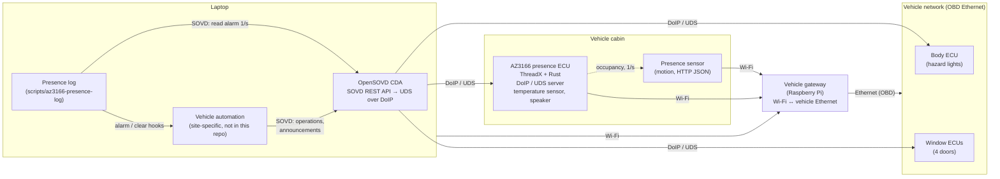
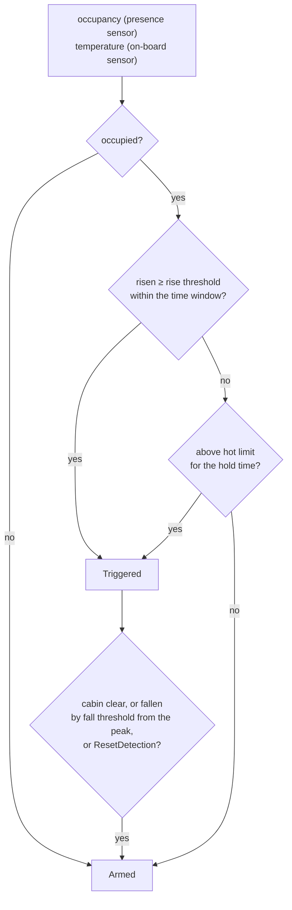
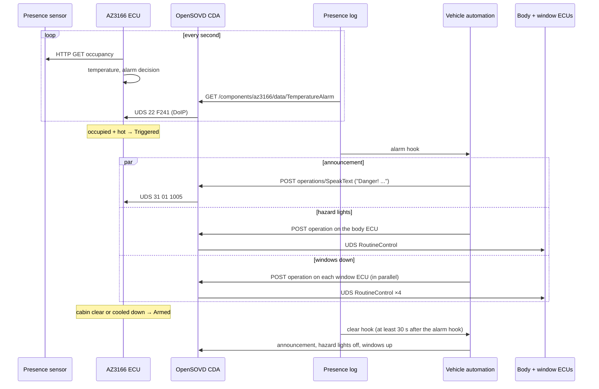

<!-- SPDX-License-Identifier: Apache-2.0 -->
<!-- This file is 100% AI-generated (Claude Code, Claude Opus 5.5). -->

# Hot-vehicle presence detection – architecture

A person (or pet) left in a vehicle that heats up is in danger. This setup
detects it and reacts: the AZ3166 acts as an additional ECU that combines an
occupancy sensor with its own temperature sensor; a laptop running the open
source [Eclipse OpenSOVD Classic Diagnostic Adapter](https://github.com/eclipse-opensovd/classic-diagnostic-adapter)
(CDA) watches it and, on an alarm, lets the vehicle open the windows and
switch on the hazard lights.

## Overview

The Raspberry Pi acts as the vehicle gateway: it connects the Wi-Fi devices
(AZ3166, presence sensor, laptop) to the vehicle's diagnostic Ethernet, so
they reach the vehicle's ECUs as if they were plugged in. The vehicle's own
ECUs are not modified.

## Components

| Component | Role |
|-----------|------|
| **Presence sensor** | Wi-Fi occupancy sensor (motion detector); serves its state as JSON over HTTP. Not visible on the diagnostic interface. |
| **AZ3166 presence ECU** | This repository. Polls the presence sensor once a second, reads its own temperature sensor and decides the alarm (below). Exposes everything as UDS over DoIP like any vehicle ECU: DIDs, a routine, a DTC, plus spoken announcements on its headphone output (SpeakText routine). Rejoins Wi-Fi by itself if the link is lost. |
| **Vehicle gateway (Raspberry Pi)** | Connects the Wi-Fi devices to the vehicle's diagnostic Ethernet (OBD). |
| **Laptop: OpenSOVD CDA** | Translates SOVD (REST/JSON) into UDS over DoIP. Knows the ECUs from their diagnostic databases (MDD), finds them on the network and manages sessions and locks. |
| **Laptop: presence log** | `scripts/az3166-presence-log`: reads the alarm state through the CDA once a second, prints changes, runs the alarm / clear hooks. |
| **Laptop: vehicle automation** | Site-specific hook scripts (not part of this repository): open / close the windows, hazard lights on / off, announcements on the AZ3166 - all as SOVD operations through the same CDA. |
| **Body ECU / window ECUs** | The vehicle's ECUs that carry out the reactions: hazard lights (body ECU) and the four power windows (window ECUs, one per door). |

## Alarm logic (in the AZ3166 firmware)

The decision runs on the AZ3166 itself (`crates/az3166-ecu/src/presence.rs`),
once a second:

| Parameter | DID | Default |
|-----------|-----|---------|
| Rise threshold | `F242` | 0.7 °C |
| Time window | `F243` | 300 s |
| Fall threshold (clears) | `F244` | 0.7 °C |
| Hot limit | `F245` | 25.0 °C |
| Hot hold time | `F246` | 60 s |

All parameters are writable in the Extended session and kept in flash. The
state is readable as `F240 PresenceState` (Clear / Occupied / Sensor Not
Available) and `F241 TemperatureAlarm` (state, temperature, window minimum,
rise); routine `1006 ResetDetection` restarts the detection from the current
temperature; DTC `C10500` reports a missing presence sensor. Details:
[diagnostics.md](diagnostics.md).

## Sequence: alarm and clear

## Alarm and clear hooks

The presence log (`scripts/az3166-presence-log`) turns alarm changes into
actions: it runs an **alarm hook** when `F241` changes to Triggered and a
**clear hook** when it changes back to Armed. The hooks are site-specific
scripts (not in this repository); like the presence log they talk to every
ECU only through the CDA, with SOVD operations.

| | Alarm hook | Clear hook |
|---|---|---|
| AZ3166 (`SpeakText`) | "Danger!" … "Hot vehicle detected." … "Danger!" (with pauses) | "Cool vehicle detected." |
| Body ECU | hazard lights on (lighting routine started) | hazard lights off (routine stopped) |
| Window ECUs | all four windows down | all four windows up |

- **At the same moment.** The actions of a hook run in parallel (one SOVD
  operation per ECU), so the hazard lights and all four windows start
  together.
- **One execution per operation.** The CDA allows one execution of an
  operation at a time; a hook first deletes a leftover execution (e.g. the
  windows-down routine before windows up).
- **Spacing.** At least 30 s pass between two hooks. Changes in between are
  merged: after the wait only the hook for the then current state runs, if
  it differs - a short alarm does not make the windows go down and up again.
  When the cabin becomes clear, the clear hook runs as soon as these 30 s
  are over.
- **Quiet.** The hooks' output goes to a log file; the presence log only
  prints the alarm state when it changes and which hook ran.

## How the CDA is used

The [OpenSOVD Classic Diagnostic Adapter](https://github.com/eclipse-opensovd/classic-diagnostic-adapter)
is the only path to every ECU, the AZ3166 included:

- **Databases.** The CDA loads one MDD per ECU from a directory. The AZ3166's
  MDD is generated from the ODX in [`odx/`](../odx) (`odx/generate.sh`); the
  vehicle ECUs' MDDs come with the vehicle.
- **Discovery.** On start the CDA broadcasts a DoIP vehicle identification
  request and also listens for vehicle announcements. The AZ3166 answers
  both, and repeats its announcement while no tester is connected, so a CDA
  started later finds it too.
- **Variant detection.** The CDA reads the variant DID and selects the
  AZ3166 App or Boot variant from the MDD.
- **Data.** `GET/PUT /vehicle/v15/components/az3166/data/<name>` read and
  write DIDs by name (`PresenceState`, `TemperatureAlarm`, `AlarmRiseThreshold`,
  ...). Scaled values (0.1 °C) are decoded into the DOP's physical type.
- **Operations.** `POST .../operations/<name>/executions` runs routines:
  Start-only routines (`ResetDetection`, `VolumeUp`) synchronously; routines
  with Stop (`SpeakText`, `AnnounceTemperature`) asynchronously - the
  execution is deleted afterwards, which sends Stop.
- **Sessions and locks.** Writes need the Extended session (`PUT .../modes/session`)
  and a lock. Locks belong to the token's identity, so the presence log and
  the vehicle automation use one identity and never block each other.
- **Flashing.** `scripts/az3166-flash` updates the AZ3166 app through the
  CDA's flash endpoints (see the README).
